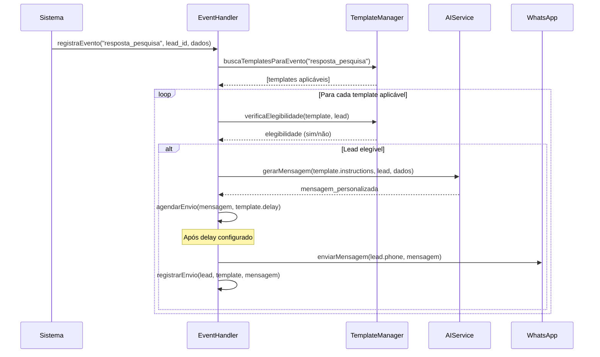

# Sistema de Configuração de Eventos Personalizados

Este documento detalha a implementação do sistema de configuração de eventos personalizados para mensagens automáticas, permitindo que administradores criem e gerenciem gatilhos de eventos customizados para cada projeto.

## Visão Geral

O sistema permite que administradores configurem mensagens automáticas através de uma interface intuitiva dentro da seção de gerenciamento de projetos. Cada evento personalizado definirá:

1. As condições que acionam a mensagem automática
2. As instruções para geração do conteúdo da mensagem
3. Configurações adicionais como tempo de espera, segmentação, etc.

## Estrutura de Dados

### Modelo de Dados no Supabase

#### Tabela: `automated_message_templates`

| Campo | Tipo | Descrição |
|-------|------|-----------|
| `id` | UUID | Identificador único do template |
| `project_id` | UUID | Referência ao projeto associado |
| `event_type` | TEXT | Tipo de evento que aciona o template (ex: `resposta_pesquisa`, `acessou_pagina`, etc.) |
| `name` | TEXT | Nome amigável para identificação do template |
| `description` | TEXT | Descrição do propósito do template |
| `instructions` | TEXT | Instruções para a IA gerar a mensagem |
| `example_message` | TEXT | Exemplo de mensagem esperada (opcional) |
| `send_delay_minutes` | INTEGER | Tempo de espera após o evento para enviar a mensagem |
| `active` | BOOLEAN | Se o template está ativo ou pausado |
| `lead_score_min` | INTEGER | Score mínimo do lead para receber esta mensagem (opcional) |
| `lead_score_max` | INTEGER | Score máximo do lead para receber esta mensagem (opcional) |
| `applicable_sentiments` | TEXT[] | Array de status de sentimento aplicáveis (opcional) |
| `max_sends_per_lead` | INTEGER | Número máximo de vezes que este template pode ser enviado para o mesmo lead |
| `created_at` | TIMESTAMP | Data de criação do template |
| `updated_at` | TIMESTAMP | Data da última atualização do template |
| `created_by` | UUID | Usuário que criou o template |

#### Tabela: `automated_message_logs`

| Campo | Tipo | Descrição |
|-------|------|-----------|
| `id` | UUID | Identificador único do log |
| `template_id` | UUID | Referência ao template usado |
| `lead_id` | UUID | Referência ao lead que recebeu a mensagem |
| `sent_at` | TIMESTAMP | Data/hora de envio da mensagem |
| `message_content` | TEXT | Conteúdo da mensagem enviada |
| `event_data` | JSONB | Dados do evento que acionou a mensagem |
| `lead_score_at_time` | INTEGER | Score do lead no momento do envio |
| `lead_sentiment_at_time` | TEXT | Status do sentimento do lead no momento do envio |
| `response_received` | BOOLEAN | Se houve resposta do lead |
| `response_time_minutes` | INTEGER | Tempo até a resposta (se houver) |
| `response_sentiment` | TEXT | Análise de sentimento da resposta (se houver) |

#### Tabela: `event_triggers`

| Campo | Tipo | Descrição |
|-------|------|-----------|
| `id` | UUID | Identificador único do gatilho |
| `project_id` | UUID | Referência ao projeto |
| `event_code` | TEXT | Código para identificação programática do evento |
| `event_name` | TEXT | Nome amigável do evento |
| `event_description` | TEXT | Descrição do que aciona este evento |
| `capture_points` | TEXT[] | Pontos no sistema onde este evento pode ser capturado |
| `required_parameters` | JSONB | Parâmetros que devem ser fornecidos quando o evento é registrado |
| `active` | BOOLEAN | Se o gatilho está ativo |
| `created_at` | TIMESTAMP | Data de criação |
| `created_by` | UUID | Usuário que criou o gatilho |

#### Tabela: `template_event_mapping`

| Campo | Tipo | Descrição |
|-------|------|-----------|
| `id` | UUID | Identificador único do mapeamento |
| `template_id` | UUID | Referência ao template de mensagem |
| `event_trigger_id` | UUID | Referência ao gatilho de evento |
| `conditions` | JSONB | Condições adicionais para aplicar o template (opcional) |
| `priority` | INTEGER | Prioridade se múltiplos templates corresponderem ao mesmo evento |

## Funcionalidades da Interface de Administração

### 1. Painel de Gerenciamento de Mensagens Automáticas

O painel será acessível dentro da página de detalhes do projeto, com uma nova aba "Mensagens Automáticas".

**Funcionalidades principais:**

- Lista de todos os templates configurados para o projeto
- Status ativo/inativo de cada template
- Estatísticas de desempenho (taxa de envio, taxa de resposta, etc.)
- Botões para adicionar, editar, duplicar ou desativar templates

### 2. Formulário de Criação/Edição de Template

Interface para configurar um novo template ou editar um existente:


**Seções do formulário:**

#### Informações Básicas
- Nome do template (ex: "Agradecimento por Resposta de Pesquisa")
- Descrição (ex: "Agradece aos leads que responderam nossa pesquisa de satisfação")
- Status (Ativo/Inativo)

#### Gatilho de Evento
- Seleção do tipo de evento (dropdown com eventos disponíveis)
- Campo para definir parâmetros específicos do evento (se aplicável)
- Opção para adicionar condições lógicas (ex: "Se o lead respondeu 4 ou 5 estrelas")

#### Conteúdo da Mensagem
- Instruções para IA (ex: "Agradecer calorosa e sinceramente pela resposta da pesquisa, mencionar que o feedback ajudará a melhorar o evento, perguntar se há algum detalhe adicional que o lead gostaria de compartilhar")
- Campo para exemplo de mensagem (opcional)
- Botão para testar a geração da mensagem com a IA

#### Configurações de Envio
- Tempo de espera após o evento (minutos)
- Restrições de lead score (mínimo/máximo)
- Status de sentimento aplicáveis (múltipla escolha)
- Limite de envios por lead
- Horários permitidos para envio

#### Pré-visualização
- Visualização em tempo real de como ficaria a mensagem para um lead de exemplo

### 3. Configuração de Eventos Personalizados

Interface para criar e gerenciar tipos de eventos personalizados:

**Funcionalidades:**

- Lista de eventos existentes (pré-definidos e personalizados)
- Formulário para adicionar novo tipo de evento
- Definição de parâmetros necessários para o evento
- Pontos de captura no sistema (onde este evento pode ser acionado)

## Fluxo de Operação

### Configuração de um Novo Template de Mensagem

1. Administrador acessa a seção "Projetos" e seleciona o projeto desejado
2. Na página de detalhes do projeto, acessa a aba "Mensagens Automáticas"
3. Clica em "Adicionar Novo Template"
4. Preenche o formulário com todas as informações necessárias:
   - Define nome e descrição
   - Seleciona o evento "resposta_pesquisa"
   - Escreve as instruções: "Agradecer pela resposta e mencionar que ajudou a tornar o evento cada vez melhor"
   - Configura as restrições de envio
5. Salva o template, que fica imediatamente disponível (se estiver marcado como ativo)

### Registro e Processamento de Eventos



## Implementação Técnica

### 1. Migração Supabase para Criar as Tabelas

```sql
-- Criar tabela de templates de mensagens automatizadas
CREATE TABLE automated_message_templates (
  id UUID PRIMARY KEY DEFAULT uuid_generate_v4(),
  project_id UUID NOT NULL REFERENCES projects(id) ON DELETE CASCADE,
  event_type TEXT NOT NULL,
  name TEXT NOT NULL,
  description TEXT,
  instructions TEXT NOT NULL,
  example_message TEXT,
  send_delay_minutes INTEGER DEFAULT 0,
  active BOOLEAN DEFAULT true,
  lead_score_min INTEGER,
  lead_score_max INTEGER,
  applicable_sentiments TEXT[],
  max_sends_per_lead INTEGER DEFAULT 1,
  created_at TIMESTAMP WITH TIME ZONE DEFAULT NOW(),
  updated_at TIMESTAMP WITH TIME ZONE DEFAULT NOW(),
  created_by UUID REFERENCES auth.users(id)
);

-- Tabela para registrar eventos disponíveis
CREATE TABLE event_triggers (
  id UUID PRIMARY KEY DEFAULT uuid_generate_v4(),
  project_id UUID NOT NULL REFERENCES projects(id) ON DELETE CASCADE,
  event_code TEXT NOT NULL,
  event_name TEXT NOT NULL,
  event_description TEXT,
  capture_points TEXT[],
  required_parameters JSONB DEFAULT '{}'::jsonb,
  active BOOLEAN DEFAULT true,
  created_at TIMESTAMP WITH TIME ZONE DEFAULT NOW(),
  created_by UUID REFERENCES auth.users(id),
  UNIQUE(project_id, event_code)
);

-- Tabela para mapeamento entre templates e eventos
CREATE TABLE template_event_mapping (
  id UUID PRIMARY KEY DEFAULT uuid_generate_v4(),
  template_id UUID REFERENCES automated_message_templates(id) ON DELETE CASCADE,
  event_trigger_id UUID REFERENCES event_triggers(id) ON DELETE CASCADE,
  conditions JSONB DEFAULT '{}'::jsonb,
  priority INTEGER DEFAULT 0,
  UNIQUE(template_id, event_trigger_id)
);

-- Tabela para log de mensagens enviadas
CREATE TABLE automated_message_logs (
  id UUID PRIMARY KEY DEFAULT uuid_generate_v4(),
  template_id UUID REFERENCES automated_message_templates(id) ON DELETE SET NULL,
  lead_id UUID REFERENCES leads(id) ON DELETE CASCADE,
  sent_at TIMESTAMP WITH TIME ZONE DEFAULT NOW(),
  message_content TEXT NOT NULL,
  event_data JSONB,
  lead_score_at_time INTEGER,
  lead_sentiment_at_time TEXT,
  response_received BOOLEAN DEFAULT false,
  response_time_minutes INTEGER,
  response_sentiment TEXT
);

-- Trigger para atualizar updated_at
CREATE TRIGGER set_updated_at
BEFORE UPDATE ON automated_message_templates
FOR EACH ROW
EXECUTE PROCEDURE update_updated_at_column();
```

### 2. Componentes de Interface

#### Página de Listagem de Templates (React)

```jsx
// frontend/src/components/projects/AutomatedMessagesTab.tsx
import React, { useEffect, useState } from 'react';
import { useRouter } from 'next/router';
import { Button, Table, Badge, Spin, Tabs, message } from 'antd';
import { PlusOutlined, EditOutlined, CopyOutlined, PauseOutlined, PlayOutlined } from '@ant-design/icons';
import { getMessageTemplates, toggleTemplateStatus } from '../../api/automatedMessages';
import { formatDate } from '../../utils/dateUtils';
import TemplateForm from './TemplateForm';

const AutomatedMessagesTab = ({ projectId }) => {
  const [templates, setTemplates] = useState([]);
  const [loading, setLoading] = useState(true);
  const [showForm, setShowForm] = useState(false);
  const [editingTemplate, setEditingTemplate] = useState(null);
  
  const fetchTemplates = async () => {
    setLoading(true);
    try {
      const data = await getMessageTemplates(projectId);
      setTemplates(data);
    } catch (error) {
      message.error('Erro ao carregar templates de mensagens');
      console.error(error);
    } finally {
      setLoading(false);
    }
  };
  
  useEffect(() => {
    fetchTemplates();
  }, [projectId]);
  
  const handleAdd = () => {
    setEditingTemplate(null);
    setShowForm(true);
  };
  
  const handleEdit = (template) => {
    setEditingTemplate(template);
    setShowForm(true);
  };
  
  const handleDuplicate = async (template) => {
    // Implementação de duplicação
  };
  
  const handleToggleStatus = async (templateId, currentStatus) => {
    try {
      await toggleTemplateStatus(templateId, !currentStatus);
      fetchTemplates();
      message.success('Status do template atualizado com sucesso');
    } catch (error) {
      message.error('Erro ao atualizar status do template');
      console.error(error);
    }
  };
  
  const handleFormClose = (refresh = false) => {
    setShowForm(false);
    if (refresh) {
      fetchTemplates();
    }
  };
  
  const columns = [
    {
      title: 'Nome',
      dataIndex: 'name',
      key: 'name',
    },
    {
      title: 'Evento',
      dataIndex: 'event_type',
      key: 'event_type',
      render: (text) => <span className="capitalize">{text.replace('_', ' ')}</span>,
    },
    {
      title: 'Status',
      dataIndex: 'active',
      key: 'active',
      render: (active) => (
        <Badge
          status={active ? 'success' : 'default'}
          text={active ? 'Ativo' : 'Inativo'}
        />
      ),
    },
    {
      title: 'Restrições',
      key: 'restrictions',
      render: (_, record) => {
        const restrictions = [];
        if (record.lead_score_min || record.lead_score_max) {
          restrictions.push(`Score: ${record.lead_score_min || '0'}-${record.lead_score_max || '100'}`);
        }
        if (record.applicable_sentiments?.length) {
          restrictions.push(`Sentimentos: ${record.applicable_sentiments.join(', ')}`);
        }
        return restrictions.join(', ') || 'Nenhuma';
      },
    },
    {
      title: 'Criado em',
      dataIndex: 'created_at',
      key: 'created_at',
      render: (date) => formatDate(date),
    },
    {
      title: 'Ações',
      key: 'actions',
      render: (_, record) => (
        <div className="flex space-x-2">
          <Button
            icon={<EditOutlined />}
            onClick={() => handleEdit(record)}
            size="small"
          />
          <Button
            icon={<CopyOutlined />}
            onClick={() => handleDuplicate(record)}
            size="small"
          />
          <Button
            icon={record.active ? <PauseOutlined /> : <PlayOutlined />}
            onClick={() => handleToggleStatus(record.id, record.active)}
            size="small"
          />
        </div>
      ),
    },
  ];
  
  return (
    <div>
      <div className="flex justify-between mb-4">
        <h2 className="text-xl font-semibold">Mensagens Automáticas</h2>
        <Button
          type="primary"
          icon={<PlusOutlined />}
          onClick={handleAdd}
        >
          Novo Template
        </Button>
      </div>
      
      {loading ? (
        <div className="flex justify-center p-10">
          <Spin size="large" />
        </div>
      ) : (
        <Table
          columns={columns}
          dataSource={templates}
          rowKey="id"
          pagination={{ pageSize: 10 }}
        />
      )}
      
      {showForm && (
        <TemplateForm
          visible={showForm}
          onClose={handleFormClose}
          projectId={projectId}
          template={editingTemplate}
        />
      )}
    </div>
  );
};

export default AutomatedMessagesTab;
```

#### Formulário de Template (React)

```jsx
// frontend/src/components/projects/TemplateForm.tsx
import React, { useEffect, useState } from 'react';
import { 
  Modal, Form, Input, Select, Slider, Switch, 
  InputNumber, Button, Divider, Spin, message 
} from 'antd';
import { getEventTriggers, createMessageTemplate, updateMessageTemplate } from '../../api/automatedMessages';

const { TextArea } = Input;
const { Option } = Select;

const TemplateForm = ({ visible, onClose, projectId, template = null }) => {
  const [form] = Form.useForm();
  const [loading, setLoading] = useState(false);
  const [submitting, setSubmitting] = useState(false);
  const [events, setEvents] = useState([]);
  const [previewMessage, setPreviewMessage] = useState('');
  const [generating, setGenerating] = useState(false);
  
  const isEditing = !!template;
  
  // Carregar eventos disponíveis
  useEffect(() => {
    const fetchEvents = async () => {
      setLoading(true);
      try {
        const data = await getEventTriggers(projectId);
        setEvents(data);
      } catch (error) {
        message.error('Erro ao carregar eventos');
        console.error(error);
      } finally {
        setLoading(false);
      }
    };
    
    fetchEvents();
  }, [projectId]);
  
  // Preencher formulário se estiver editando
  useEffect(() => {
    if (template) {
      form.setFieldsValue({
        name: template.name,
        event_type: template.event_type,
        description: template.description,
        instructions: template.instructions,
        example_message: template.example_message,
        send_delay_minutes: template.send_delay_minutes,
        active: template.active,
        lead_score_range: [
          template.lead_score_min || 0,
          template.lead_score_max || 100
        ],
        applicable_sentiments: template.applicable_sentiments || [],
        max_sends_per_lead: template.max_sends_per_lead || 1
      });
    }
  }, [template, form]);
  
  const handleSubmit = async () => {
    try {
      const values = await form.validateFields();
      setSubmitting(true);
      
      // Processar valores
      const [lead_score_min, lead_score_max] = values.lead_score_range || [0, 100];
      
      const templateData = {
        name: values.name,
        event_type: values.event_type,
        description: values.description,
        instructions: values.instructions,
        example_message: values.example_message,
        send_delay_minutes: values.send_delay_minutes,
        active: values.active,
        lead_score_min,
        lead_score_max,
        applicable_sentiments: values.applicable_sentiments,
        max_sends_per_lead: values.max_sends_per_lead,
        project_id: projectId
      };
      
      if (isEditing) {
        await updateMessageTemplate(template.id, templateData);
        message.success('Template atualizado com sucesso');
      } else {
        await createMessageTemplate(templateData);
        message.success('Template criado com sucesso');
      }
      
      onClose(true);
    } catch (error) {
      console.error('Erro ao salvar template:', error);
      message.error('Erro ao salvar template');
    } finally {
      setSubmitting(false);
    }
  };
  
  const generatePreview = async () => {
    const values = form.getFieldsValue();
    if (!values.instructions) {
      message.warning('Preencha as instruções para gerar um exemplo');
      return;
    }
    
    setGenerating(true);
    try {
      // Aqui faria a chamada para a API de IA para gerar um exemplo
      // Por enquanto apenas simularemos o resultado
      setTimeout(() => {
        setPreviewMessage(
          `Olá [Nome do Lead], agradecemos muito por responder nossa pesquisa! Seu feedback é fundamental para continuarmos melhorando nosso evento. Há algo específico que gostaria de compartilhar sobre sua experiência?`
        );
        setGenerating(false);
      }, 1500);
    } catch (error) {
      message.error('Erro ao gerar exemplo de mensagem');
      setGenerating(false);
    }
  };
  
  if (loading) {
    return (
      <Modal
        title={isEditing ? "Editar Template" : "Novo Template"}
        open={visible}
        onCancel={() => onClose()}
        footer={null}
        width={800}
      >
        <div className="flex justify-center py-10">
          <Spin size="large" />
        </div>
      </Modal>
    );
  }
  
  return (
    <Modal
      title={isEditing ? "Editar Template" : "Novo Template"}
      open={visible}
      onCancel={() => onClose()}
      footer={[
        <Button key="cancel" onClick={() => onClose()}>
          Cancelar
        </Button>,
        <Button 
          key="submit" 
          type="primary" 
          loading={submitting}
          onClick={handleSubmit}
        >
          Salvar
        </Button>
      ]}
      width={800}
    >
      <Form
        form={form}
        layout="vertical"
      >
        <Divider>Informações Básicas</Divider>
        
        <Form.Item
          name="name"
          label="Nome do Template"
          rules={[{ required: true, message: 'Por favor informe um nome' }]}
        >
          <Input placeholder="Ex: Agradecimento por Resposta de Pesquisa" />
        </Form.Item>
        
        <Form.Item
          name="description"
          label="Descrição"
        >
          <TextArea 
            placeholder="Descreva o propósito deste template"
            rows={2}
          />
        </Form.Item>
        
        <Form.Item
          name="active"
          label="Status"
          valuePropName="checked"
          initialValue={true}
        >
          <Switch checkedChildren="Ativo" unCheckedChildren="Inativo" />
        </Form.Item>
        
        <Divider>Gatilho de Evento</Divider>
        
        <Form.Item
          name="event_type"
          label="Tipo de Evento"
          rules={[{ required: true, message: 'Selecione um tipo de evento' }]}
        >
          <Select placeholder="Selecione o evento que acionará esta mensagem">
            {events.map(event => (
              <Option key={event.event_code} value={event.event_code}>
                {event.event_name}
              </Option>
            ))}
          </Select>
        </Form.Item>
        
        <Divider>Conteúdo da Mensagem</Divider>
        
        <Form.Item
          name="instructions"
          label="Instruções para IA"
          rules={[{ required: true, message: 'Por favor forneça instruções' }]}
        >
          <TextArea 
            placeholder="Ex: Agradecer pela resposta da pesquisa e mencionar que ajudou a tornar o evento melhor"
            rows={4}
          />
        </Form.Item>
        
        <Form.Item
          name="example_message"
          label="Exemplo de Mensagem (opcional)"
        >
          <TextArea 
            placeholder="Exemplo de como você espera que a mensagem fique"
            rows={3}
          />
        </Form.Item>
        
        <div className="mb-4">
          <Button 
            type="default" 
            onClick={generatePreview}
            loading={generating}
          >
            Gerar Exemplo com IA
          </Button>
        </div>
        
        {previewMessage && (
          <div className="bg-gray-50 p-4 border rounded mb-4">
            <h4 className="text-sm font-semibold mb-2">Exemplo gerado:</h4>
            <p className="text-gray-700">{previewMessage}</p>
          </div>
        )}
        
        <Divider>Configurações de Envio</Divider>
        
        <Form.Item
          name="send_delay_minutes"
          label="Tempo de espera após o evento (minutos)"
          initialValue={0}
        >
          <InputNumber min={0} max={1440} />
        </Form.Item>
        
        <Form.Item
          name="lead_score_range"
          label="Faixa de Lead Score"
          initialValue={[0, 100]}
        >
          <Slider 
            range 
            min={0} 
            max={100}
            marks={{
              0: '0',
              25: '25',
              50: '50',
              75: '75',
              100: '100'
            }}
          />
        </Form.Item>
        
        <Form.Item
          name="applicable_sentiments"
          label="Status de Sentimento Aplicáveis"
        >
          <Select
            mode="multiple"
            placeholder="Selecione os status de sentimento (ou deixe vazio para todos)"
            allowClear
          >
            <Option value="interessado">Interessado</Option>
            <Option value="achou caro">Achou Caro</Option>
            <Option value="quer desconto">Quer Desconto</Option>
            <Option value="parcelamento">Parcelamento</Option>
            <Option value="compra futura">Compra Futura</Option>
            <Option value="sem interesse">Sem Interesse</Option>
            <Option value="indeterminado">Indeterminado</Option>
          </Select>
        </Form.Item>
        
        <Form.Item
          name="max_sends_per_lead"
          label="Máximo de envios por lead"
          initialValue={1}
        >
          <InputNumber min={1} max={10} />
        </Form.Item>
      </Form>
    </Modal>
  );
};

export default TemplateForm;
```

### 3. Backend para Gerenciamento de Templates

```typescript
// backend/src/controllers/automatedMessagesController.ts
import { Request, Response } from 'express';
import { supabase } from '../services/supabaseService';

export const getMessageTemplates = async (req: Request, res: Response) => {
  try {
    const projectId = req.params.projectId;
    
    const { data, error } = await supabase
      .from('automated_message_templates')
      .select('*')
      .eq('project_id', projectId)
      .order('created_at', { ascending: false });
    
    if (error) throw error;
    
    return res.status(200).json(data);
  } catch (error) {
    console.error('Error fetching message templates:', error);
    return res.status(500).json({ error: 'Failed to fetch message templates' });
  }
};

export const getEventTriggers = async (req: Request, res: Response) => {
  try {
    const projectId = req.params.projectId;
    
    const { data, error } = await supabase
      .from('event_triggers')
      .select('*')
      .eq('project_id', projectId)
      .eq('active', true)
      .order('event_name', { ascending: true });
    
    if (error) throw error;
    
    return res.status(200).json(data);
  } catch (error) {
    console.error('Error fetching event triggers:', error);
    return res.status(500).json({ error: 'Failed to fetch event triggers' });
  }
};

export const createMessageTemplate = async (req: Request, res: Response) => {
  try {
    const templateData = req.body;
    const userId = req.user.id;
    
    // Adicionar usuário que está criando
    templateData.created_by = userId;
    
    const { data, error } = await supabase
      .from('automated_message_templates')
      .insert(templateData)
      .select();
    
    if (error) throw error;
    
    return res.status(201).json(data[0]);
  } catch (error) {
    console.error('Error creating message template:', error);
    return res.status(500).json({ error: 'Failed to create message template' });
  }
};

export const updateMessageTemplate = async (req: Request, res: Response) => {
  try {
    const templateId = req.params.id;
    const templateData = req.body;
    
    // Atualizar timestamp
    templateData.updated_at = new Date().toISOString();
    
    const { data, error } = await supabase
      .from('automated_message_templates')
      .update(templateData)
      .eq('id', templateId)
      .select();
    
    if (error) throw error;
    
    return res.status(200).json(data[0]);
  } catch (error) {
    console.error('Error updating message template:', error);
    return res.status(500).json({ error: 'Failed to update message template' });
  }
};

export const toggleTemplateStatus = async (req: Request, res: Response) => {
  try {
    const templateId = req.params.id;
    const { active } = req.body;
    
    const { data, error } = await supabase
      .from('automated_message_templates')
      .update({ 
        active,
        updated_at: new Date().toISOString()
      })
      .eq('id', templateId)
      .select();
    
    if (error) throw error;
    
    return res.status(200).json(data[0]);
  } catch (error) {
    console.error('Error toggling template status:', error);
    return res.status(500).json({ error: 'Failed to toggle template status' });
  }
};

export const createEventTrigger = async (req: Request, res: Response) => {
  try {
    const eventData = req.body;
    const userId = req.user.id;
    
    // Adicionar usuário que está criando
    eventData.created_by = userId;
    
    const { data, error } = await supabase
      .from('event_triggers')
      .insert(eventData)
      .select();
    
    if (error) throw error;
    
    return res.status(201).json(data[0]);
  } catch (error) {
    console.error('Error creating event trigger:', error);
    return res.status(500).json({ error: 'Failed to create event trigger' });
  }
};
```

### 4. Serviço para Processamento de Eventos

```typescript
// backend/src/services/eventProcessingService.ts
import { supabase } from './supabaseService';
import { aiService } from './aiService';
import { whatsappService } from './whatsappService';

/**
 * Registra um evento para um lead e processa templates aplicáveis
 */
export const processEvent = async (
  eventType: string,
  leadId: string,
  eventData: any
) => {
  try {
    // 1. Buscar templates aplicáveis para este tipo de evento
    const { data: templates, error: templatesError } = await supabase
      .from('automated_message_templates')
      .select('*')
      .eq('event_type', eventType)
      .eq('active', true);
    
    if (templatesError) throw templatesError;
    
    if (!templates || templates.length === 0) {
      console.log(`No templates found for event ${eventType}`);
      return { processed: false, reason: 'no_templates' };
    }
    
    // 2. Buscar informações do lead
    const { data: lead, error: leadError } = await supabase
      .from('leads')
      .select('*')
      .eq('id', leadId)
      .single();
    
    if (leadError) throw leadError;
    if (!lead) {
      console.error(`Lead not found: ${leadId}`);
      return { processed: false, reason: 'lead_not_found' };
    }
    
    // 3. Verificar elegibilidade do lead (não contatar, etc)
    if (lead.do_not_contact) {
      return { processed: false, reason: 'lead_do_not_contact' };
    }
    
    // 4. Filtrar templates por critérios (score, sentimento, etc)
    const eligibleTemplates = templates.filter(template => {
      // Verificar restrições de lead score
      if (template.lead_score_min && lead.lead_score < template.lead_score_min) {
        return false;
      }
      if (template.lead_score_max && lead.lead_score > template.lead_score_max) {
        return false;
      }
      
      // Verificar status de sentimento
      if (template.applicable_sentiments && 
          template.applicable_sentiments.length > 0 && 
          !template.applicable_sentiments.includes(lead.sentiment_status)) {
        return false;
      }
      
      // Verificar limite de envios por lead
      return checkSendLimit(template.id, leadId, template.max_sends_per_lead);
    });
    
    if (eligibleTemplates.length === 0) {
      return { processed: false, reason: 'no_eligible_templates' };
    }
    
    // 5. Agendar envio de mensagens para cada template
    const scheduledMessages = [];
    
    for (const template of eligibleTemplates) {
      const delay = template.send_delay_minutes * 60 * 1000; // converter para ms
      
      // Se tem delay, agendar para depois
      if (delay > 0) {
        setTimeout(() => {
          sendAutomatedMessage(template, lead, eventData);
        }, delay);
        
        scheduledMessages.push({
          template_id: template.id,
          scheduled_for: new Date(Date.now() + delay),
          lead_id: leadId
        });
      } else {
        // Enviar imediatamente
        const result = await sendAutomatedMessage(template, lead, eventData);
        scheduledMessages.push({
          template_id: template.id,
          sent: true,
          lead_id: leadId,
          message_id: result.messageId
        });
      }
    }
    
    return {
      processed: true,
      scheduled_messages: scheduledMessages
    };
  } catch (error) {
    console.error('Error processing event:', error);
    throw error;
  }
};

/**
 * Envia uma mensagem automatizada baseada em um template e dados do lead
 */
const sendAutomatedMessage = async (template, lead, eventData) => {
  try {
    // 1. Preparar dados para o serviço de IA
    const context = {
      lead_info: {
        name: lead.name,
        sentiment_status: lead.sentiment_status,
        lead_score: lead.lead_score
      },
      event_type: template.event_type,
      event_data: eventData,
      instructions: template.instructions
    };
    
    // 2. Gerar mensagem personalizada com IA
    const messageContent = await aiService.generateEventMessage(context);
    
    // 3. Enviar mensagem via WhatsApp
    const whatsappResult = await whatsappService.sendMessage(lead.phone, messageContent);
    
    // 4. Registrar log da mensagem
    const { data, error } = await supabase
      .from('automated_message_logs')
      .insert({
        template_id: template.id,
        lead_id: lead.id,
        message_content: messageContent,
        event_data: eventData,
        lead_score_at_time: lead.lead_score,
        lead_sentiment_at_time: lead.sentiment_status
      });
    
    if (error) throw error;
    
    return {
      success: true,
      messageId: whatsappResult.id
    };
  } catch (error) {
    console.error('Error sending automated message:', error);
    throw error;
  }
};

/**
 * Verifica se um lead já recebeu o número máximo de mensagens de um template
 */
const checkSendLimit = async (templateId, leadId, maxSends) => {
  const { count, error } = await supabase
    .from('automated_message_logs')
    .select('*', { count: 'exact', head: true })
    .eq('template_id', templateId)
    .eq('lead_id', leadId);
  
  if (error) {
    console.error('Error checking send limit:', error);
    return false;
  }
  
  return count < maxSends;
};
```

## Pré-configuração de Eventos Padrão

Para facilitar o início do uso, o sistema virá com alguns eventos pré-configurados:

| Código de Evento | Nome | Descrição |
|------------------|------|-----------|
| `resposta_pesquisa` | Resposta de Pesquisa | Quando um lead responde a uma pesquisa |
| `carrinho_abandonado` | Carrinho Abandonado | Quando um lead adiciona itens ao carrinho mas não finaliza a compra |
| `visualizou_propriedade` | Visualizou Propriedade | Quando um lead visualiza detalhes de uma propriedade específica |
| `solicitou_informacoes` | Solicitou Informações | Quando um lead preenche um formulário solicitando informações |
| `visualizou_precos` | Visualizou Preços | Quando um lead acessa informações de preços/condições |
| `dias_sem_resposta` | Dias Sem Resposta | Evento automático quando o lead fica X dias sem responder |
| `aniversario_lead` | Aniversário do Lead | Quando é aniversário do lead (se data fornecida) |
| `mudanca_status` | Mudança de Status | Quando o status do lead muda |

## Registrando Eventos no Sistema

Para eventos gerados por ações do usuário no site ou aplicativo:

```javascript
// Exemplo de como registrar um evento no frontend
import { registerLeadEvent } from '../api/events';

// Quando um lead responde uma pesquisa
async function handleSurveySubmit(surveyData) {
  try {
    // Salvar resposta da pesquisa
    await saveSurveyResponse(surveyData);
    
    // Registrar evento
    await registerLeadEvent('resposta_pesquisa', leadId, {
      survey_id: surveyData.surveyId,
      rating: surveyData.rating,
      comments: surveyData.comments
    });
    
    // Continuar fluxo normal...
  } catch (error) {
    console.error('Error submitting survey:', error);
  }
}
```

## Considerações de Implementação

### Segurança

1. **Validação de Dados**:
   - Validar todos os parâmetros de eventos antes de processá-los
   - Sanitizar as entradas do usuário para evitar injeção

2. **Permissões**:
   - Apenas usuários com permissão de administrador no projeto podem gerenciar templates
   - Registrar todos os eventos e ações com o usuário que os executou

### Performance

1. **Processamento Assíncrono**:
   - Utilizar filas para processar eventos de alta demanda
   - Implementar throttling para evitar sobrecarga

2. **Caching**:
   - Cachear templates e configurações para reduzir consultas ao banco

### Monitoramento

1. **Logs Detalhados**:
   - Registrar todas as etapas do processamento de eventos
   - Capturar erros com contexto suficiente para depuração

2. **Dashboard de Performance**:
   - Mostrar estatísticas de envio, resposta e conversão
   - Alertas para falhas no sistema

## Próximos Passos

1. **Implementar o UI/UX** conforme especificações acima
2. **Criar as tabelas** no Supabase para armazenar templates e configurações
3. **Desenvolver o backend** para processamento de eventos
4. **Integrar** com o serviço de IA para geração de mensagens
5. **Configurar eventos padrão** no sistema
6. **Testar em ambiente controlado** antes de lançar para produção